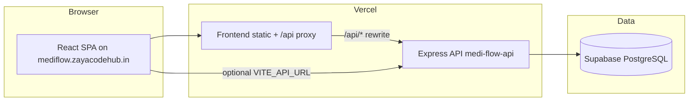

# MEDI FLOW — Smart Healthcare Management System

**Live website:** [https://mediflow.zayacodehub.in/](https://mediflow.zayacodehub.in/)

MEDI FLOW is a full-stack healthcare platform: separate **role-based portals** for patients, doctors, pharmacy staff, appointment staff, and platform admins. It includes **AI symptom screening**, an **in-app medical assistant** (chat + appointment booking), **doctor verification**, vitals, lab reports, and operational dashboards.

**Repository:** [github.com/shivshankarjayswal63-art/MEDI-FLOW](https://github.com/shivshankarjayswal63-art/MEDI-FLOW)

| Environment | URL |
|-------------|-----|
| **Production app** | [https://mediflow.zayacodehub.in/](https://mediflow.zayacodehub.in/) |
| **API (direct)** | `https://medi-flow-api.vercel.app` |
| **API (via app)** | `https://mediflow.zayacodehub.in/api/*` (proxied on Vercel) |

---

## Table of contents

1. [How the system works](#how-the-system-works)
2. [Portals, roles & demo logins](#portals-roles--demo-logins)
3. [Feature guide by role](#feature-guide-by-role)
4. [Key workflows](#key-workflows)
5. [AI & medical assistant](#ai--medical-assistant)
6. [Doctor verification](#doctor-verification)
7. [Database & migrations](#database--migrations)
8. [Tech stack](#tech-stack)
9. [Local development](#local-development)
10. [Deployment & custom domain](#deployment--custom-domain)
11. [Symptom ML model (optional)](#symptom-ml-model-optional)
12. [Project structure](#project-structure)

---

## How the system works



1. **Frontend** (Vite + React) is hosted on Vercel at your custom domain. Most API calls go to **`/api/...` on the same domain**, which Vercel forwards to the backend (avoids CORS issues for the floating health chat).
2. **Backend** (Node.js + Express) runs as a separate Vercel project (`BACKEND/`). It uses **JWT** auth and **Supabase** (PostgreSQL) via the service role key—not Supabase Auth for portal login.
3. **Roles** are stored on `users.role` and enforced in the UI (`RoleGuard`) and on APIs (`requireRole`, dashboard portal checks). Staff demo emails are also mapped in code so the correct portal wins even if the DB role is stale.
4. **Doctors** live in the `doctors` table and sign in only at **`/login-doctor`**. New self-registrations stay **pending** until a **platform admin** approves them.

---

## Portals, roles & demo logins

Use these after seeding demo data (`cd BACKEND && npm run db:seed`) against your Supabase project.

| Role | Sign-in page | Dashboard / home | Email | Password |
|------|----------------|------------------|-------|----------|
| **Patient** | [/login](https://mediflow.zayacodehub.in/login) | `/patient-dashboard` | `patient1@demo.com` | `Patient@123` |
| Patient (alt) | `/login` | `/patient-dashboard` | `patient2@demo.com` … `patient5@demo.com` | `Patient@123` |
| **Platform admin** | `/login` | `/User-Dashboard` | `useradmin@gmail.com` | `Admin@123` |
| **Pharmacy admin** | `/login` | `/Pharmacy-Dashboard` | `pharmacyadmin@gmail.com` | `Admin@123` |
| **Appointment admin** | `/login` | `/Appointment-Dashboard` | `appointmentadmin@gmail.com` | `Admin@123` |
| **Doctor** | [/login-doctor](https://mediflow.zayacodehub.in/login-doctor) | `/Doctor-Dashboard` | `doctoradmin@gmail.com` | `Admin@123` |

### Login rules

| Account type | Must use |
|--------------|----------|
| Patient, platform admin, pharmacy admin, appointment admin | **`/login`** only |
| Doctor (and approved doctor registrations) | **`/login-doctor`** only |

- Doctor emails **cannot** use `/login` (API returns a message to use doctor login).
- Staff emails **cannot** use `/login-doctor`.
- Wrong portal or wrong role → redirect to the correct dashboard or a clear error.

### Custom platform admin

```bash
cd BACKEND
# In .env (never commit):
# PLATFORM_ADMIN_EMAIL=your@gmail.com
# PLATFORM_ADMIN_PASSWORD=YourSecurePassword
npm run admin:ensure
```

Then sign in at **`/login`** → **`/User-Dashboard`**.

`zayacodehub@gmail.com` is treated as platform admin when that user exists (via `admin:ensure` or email map).

### Quick links on production

| Page | URL |
|------|-----|
| Home | [https://mediflow.zayacodehub.in/](https://mediflow.zayacodehub.in/) |
| Patient login | [https://mediflow.zayacodehub.in/login](https://mediflow.zayacodehub.in/login) |
| Doctor login | [https://mediflow.zayacodehub.in/login-doctor](https://mediflow.zayacodehub.in/login-doctor) |
| Register (patient) | `/registration` |
| Register (doctor) | `/register-doctor` |
| Find a doctor | `/Find-Doctor` |

---

## Feature guide by role

### Patient (`patient`)

- **Dashboard** — appointments, vitals trend, recent analyses, lab reports, prescriptions, notifications.
- **Medical assistant** (`/medical-assistant`) — conversational help, remembers chat (DB + browser), **in-app booking** (doctor → date → time → visit mode → confirm).
- **Floating AI Health Assistant** — on most public pages; same backend chat API; chips for quick prompts.
- **Symptom analysis** — structured symptom flow + history (`/symptom-analysis`, `/analysis-history`).
- **Vitals** — log BP, pulse, sugar (`/enter-vitals`, `/health-trends`).
- **Online results** — upload medical reports (PDF/images); AI can use summaries for doctor matching.
- **Find a doctor** — only **admin-approved** doctors.
- **Book appointment** — `/Book-Appointment` (approved doctors only).
- **Profile** — `/User-Account` (patient-only).

### Platform admin (`user_admin`)

- **User Administration Dashboard** — patient counts, appointments today, **pending doctor approvals**.
- **Registered patients** — `/User-Management`.
- **Add patients** — `/Add-New-Patient`.
- **Doctor verification** — `/Doctor-Approvals` (approve / reject / revoke).

### Pharmacy admin (`pharmacy_admin`)

- Pharmacy dashboard, stock analytics, orders, stock adding, recent prescriptions.

### Appointment admin (`appointment_admin`)

- Appointment dashboard, booking management, rejected appointments.

### Doctor (`doctor`)

- Doctor dashboard, view appointments, leave management, diagnosis & prescriptions (approved doctors only can sign in).

---

## Key workflows

### 1. Patient registration & login

1. `/registration` → creates `users` row with `role: patient`.
2. `/login` → JWT + redirect to `/patient-dashboard`.

### 2. Medical assistant & booking (patient)

1. Open **Medical assistant** from the patient menu or send **“Book appointment”** from the floating chat.
2. Assistant suggests **approved** doctors (optionally personalized from vitals/reports).
3. Wizard: doctor → date → time → in-person / video → confirm.
4. `POST /api/medical-assistant/book` creates appointment (patient JWT required).

### 3. Doctor self-registration & approval

1. Doctor fills **`/register-doctor`** → status **`pending`**, no login until approved.
2. Platform admin opens **`/Doctor-Approvals`** → **Approve** or **Reject** (with reason).
3. **Approved** → doctor can use **`/login-doctor`** and appears in `/api/doctor/public`, booking, and assistant.
4. **Rejected** → login blocked with rejection message.

### 4. Symptom AI (novelty)

1. Patient uses **Symptom analysis** with symptom list.
2. Backend may use trained sklearn model (`/api/novelty/analyze`) when the Python stack is available; otherwise screening/FAQ paths still respond.

### 5. Staff / doctor login separation

- Frontend: `RoleGuard` on every portal route; `setAuthSession` clears cross-portal state.
- Backend: `attachUserFromJwt` resolves role from JWT + staff email map on every protected request.

---

## AI & medical assistant

| Component | Behavior |
|-----------|----------|
| **NVIDIA Nemotron** (optional) | Set `NVIDIA_API_KEY` on API; falls back to built-in screening if slow or missing. |
| **Chat** | `POST /api/medical-assistant/chat` (optional auth — richer context when patient is logged in). |
| **Session** | `GET /api/medical-assistant/session` when migration `003` is applied. |
| **Book** | `POST /api/medical-assistant/book` (patient only). |
| **Floating widget** | Uses same API via `/api/...` on [mediflow.zayacodehub.in](https://mediflow.zayacodehub.in/). |

Patient health context (allergies, chronic conditions, report AI summaries) is injected when migration **`004`** is applied and profile/reports are filled in.

---

## Doctor verification

| Status | Patient visibility | Doctor login |
|--------|-------------------|--------------|
| `pending` | Hidden | Blocked |
| `approved` | Visible | Allowed |
| `rejected` | Hidden | Blocked (reason shown) |

**SQL:** run `supabase/migrations/005_doctor_approval.sql` in the Supabase SQL editor.

Demo seed doctors are inserted with `approval_status: approved`.

---

## Database & migrations

Run in order in **Supabase → SQL**:

| File | Purpose |
|------|---------|
| `001_hcms_schema.sql` | Core tables (users, doctors, appointments, …) |
| `002_roles_and_notifications.sql` | `users.role`, notifications |
| `003_medical_assistant_chat.sql` | Server-side chat history |
| `004_patient_health_profile.sql` | Allergies, report AI fields |
| `005_doctor_approval.sql` | Doctor `approval_status`, reject reason |

Seed demo users, doctors, appointments:

```bash
cd BACKEND
npm run db:seed
```

Fix staff roles in DB if needed: `npm run fix:staff-roles`

---

## Tech stack

| Layer | Technology |
|-------|------------|
| Frontend | React 18, Vite, React Router, MUI, Tailwind |
| Backend | Node.js, Express |
| Database | **Supabase (PostgreSQL)** |
| Auth | JWT (custom login; not Supabase Auth for portals) |
| Hosting | Vercel (frontend + API projects) |
| AI | Medical assistant (Nemotron + rules), optional Python sklearn models in `BACKEND/ai-model/` |

---

## Local development

### Prerequisites

- Node.js 18+
- Supabase project + keys in `BACKEND/.env` and `frontend/.env`

### Backend

```bash
cd BACKEND
npm install
cp .env.example .env   # fill SUPABASE_*, JWT_SECRET, FRONTEND01=http://localhost:5173
npm start              # http://localhost:5000
```

### Frontend

```bash
cd frontend
npm install
# .env: VITE_API_URL=http://localhost:5000  (or omit — Vite proxies /api to :5000)
npm run dev            # http://localhost:5173
```

### Demo logins locally

Same emails/passwords as [Portals, roles & demo logins](#portals-roles--demo-logins) after `npm run db:seed`.

---

## Deployment & custom domain

Detailed steps: **[BACKEND/DEPLOY.md](./BACKEND/DEPLOY.md)** and **[VERCEL.md](./VERCEL.md)**.

**Production checklist for [mediflow.zayacodehub.in](https://mediflow.zayacodehub.in/):**

| Step | Action |
|------|--------|
| Frontend Vercel | Root = `frontend`; domain = `mediflow.zayacodehub.in` |
| API Vercel | Root = `BACKEND`; env: `SUPABASE_*`, `JWT_SECRET` |
| CORS | `FRONTEND01=https://mediflow.zayacodehub.in` or `CORS_ORIGIN_SUFFIX=zayacodehub.in` on API |
| Chat / API | Redeploy frontend so `/api` proxy in `frontend/vercel.json` is active |
| Health check | `https://mediflow.zayacodehub.in/api/health` → JSON |

Shorter login reference: **[PORTAL_LOGINS.md](./PORTAL_LOGINS.md)**

---

## Symptom ML model (optional)

Trained on Kaggle-style symptom data in `BACKEND/ai-model/datasets/`.

```bash
cd BACKEND/ai-model
pip install -r requirements.txt
python train_model.py
```

| Model | Algorithm | Notes |
|-------|-----------|--------|
| Disease prediction | Random Forest | 43 conditions from 134 symptoms |
| Heart risk | Random Forest | Cardiovascular risk |

API examples (when AI service is wired):

- `POST /api/novelty/analyze`
- `GET /api/model/status`

On Vercel serverless, long-running Python is not on the same host; use a separate AI host via `AI_API_URL` or rely on the medical assistant screening engine.

---

## Project structure

```
MEDI-FLOW/
├── frontend/                 # React SPA (Vercel root: frontend)
│   ├── src/Components/     # Patient, Doctor, Pharmacy, Appointment, User Admin, Novelty
│   └── vercel.json           # SPA + /api proxy to medi-flow-api
├── BACKEND/                  # Express API (Vercel root: BACKEND)
│   ├── Controllers/
│   ├── Routes/
│   ├── lib/                  # roles, doctorApproval, appointmentAssistant, …
│   └── ai-model/             # Optional Python ML
├── supabase/migrations/      # SQL migrations 001–005
├── README.md                 # This file
├── PORTAL_LOGINS.md
├── BACKEND/DEPLOY.md
└── VERCEL.md
```

---

## Design system

| Token | Hex | Use |
|-------|-----|-----|
| Primary blue | `#2b2c6c` | Headers, nav |
| Accent pink | `#e6317d` | CTAs |
| Secondary green | `#2fb297` | Success, assistant |

---

## Contributors

ITPM_Y3S1_WE_91 Group · [Zaya Code Hub](https://zayacodehub.in)

---

## License

All rights reserved — MEDI FLOW.
